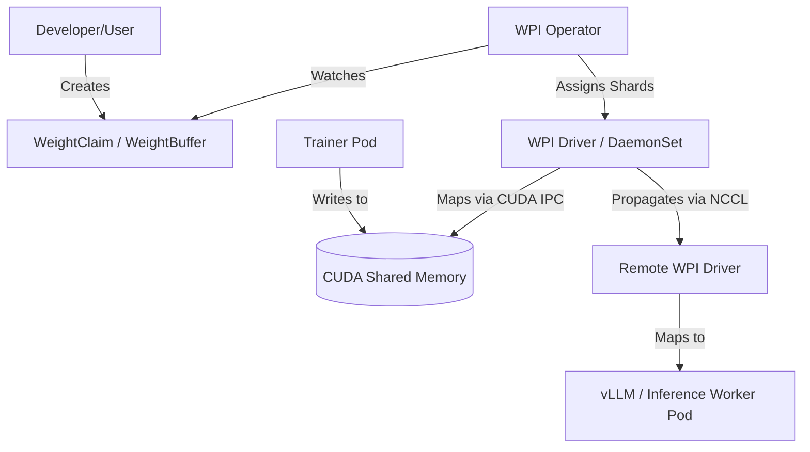

# Weight Propagation Interface (WPI)

The **Weight Propagation Interface (WPI)** is a Kubernetes-native orchestration framework designed to enable high-speed, zero-copy movement of large ML model weights between AI accelerators (GPUs, TPUs) across nodes in a cluster.

As models grow to hundreds of billions of parameters, the traditional path of saving weights to shared storage and independently downloading them into GPU RAM becomes a severe bottleneck. WPI solves this by treating Model Weights as first-class scheduling and hardware resources, leveraging native hardware interconnects (like NVLink and InfiniBand via NCCL) to securely and efficiently distribute weights directly into accelerator memory.

## 📺 Demo

Check out the [WPI Demo Video](https://youtu.be/I3bRaShPILE) to see the system in action!

## 🏗️ Architecture

WPI consists of three main architectural layers, coordinated to move weights with zero-copy efficiency:



1.  🧬 **Custom Resource Definitions (CRDs):** Define logical blocks of weights (`WeightBuffer`) and how workloads bind to them (`WeightClaim`). Supports automatic model sharding for tensor, pipeline, and expert parallelism.
2.  🧠 **WPI Operator (The Brain):** A Kubernetes controller that reconciles the desired distribution of weights with the cluster's physical topology, including shard discovery and per-claim shard assignment.
3.  🚚 **WPI Driver / Node Agent (The Mover):** A privileged daemonset running on accelerator nodes that executes hardware-specific commands (CUDA IPC, NCCL) to allocate, share, and transmit memory. Supports both broadcast (1-to-N identical) and scatter (1-to-N sharded) propagation modes.
4.  🤖 **Consumer (The Workload):** The ML framework (e.g., PyTorch, vLLM) that natively binds to the shared weight memory without allocating a duplicate copy.


## 📦 Installation

You can install the WPI client library directly from GitHub:

```bash
pip install git+https://github.com/llm-d-incubation/weight-propagation-interface.git#subdirectory=consumer/wpi_client
```


## 📂 Repository Structure

- `operator/`: Kubernetes controller for WPI.
- `driver/`: Node agent (Python controller and Go-based DRA plugin).
- `proto/`: gRPC service definitions (`wpi.proto`).
- `crds/`: Kubernetes Custom Resource manifests.
- `consumer/`: Example workloads and pod specifications demonstrating WPI integration.

## 🔌 Integrations

WPI seamlessly integrates with distributed ML training frameworks to eliminate storage bottlenecks during frequent weight synchronization between training and rollout/inference workers:

- [**verl**](consumer/wpi_verl_plugin/README.md): WPI is fully integrated as a `CheckpointEngine` backend for `verl`. This enables high-throughput, zero-copy weight propagation from RL trainers to rollout workers over RDMA.

## 📊 Performance

WPI delivers near-line-rate weight propagation by eliminating storage overheads and avoiding CPU staging.

| Scenario | Payload Size | Hardware | Throughput |
| :--- | :--- | :--- | :--- |
| **Multi-Node Broadcast** | ~75 GB | A3 Ultra (InfiniBand) | **37.42 GB/s** |
| **Multi-Node Broadcast** | ~14.2 GB | Qwen2-7B (RoCE/NCCL) | **~20.4 GB/s** |
| **Multi-Node Broadcast** | ~6 GB | Qwen2.5-3B (RoCE/NCCL) | **~15.97 GB/s** |

## 🔌 Quick Example

Here is a minimal example of a `WeightBuffer` and a `WeightClaim` to bind an inference workload to a shared weight buffer:

```yaml
apiVersion: wpi.sig.k8s.io/v1alpha1
kind: WeightBuffer
metadata:
  name: vllm-weight-buffer
  namespace: wpi-system
spec:
  capacity: "75Gi"  # 75 GiB — adjust to your model size

---
apiVersion: wpi.sig.k8s.io/v1alpha1
kind: WeightClaim
metadata:
  name: vllm-weight-claim
  namespace: wpi-system
spec:
  weightBufferName: vllm-weight-buffer
```

## 🚀 Getting Started

Check out the following documents for more details:

- [WPI Design Document](WPI_DESIGN.md): Detailed architectural design.
- [WPI User Guide](WPI_USER_GUIDE.md): Setup and usage instructions.

Use `setup.sh` to initialize the environment and `teardown.sh` to clean up.
